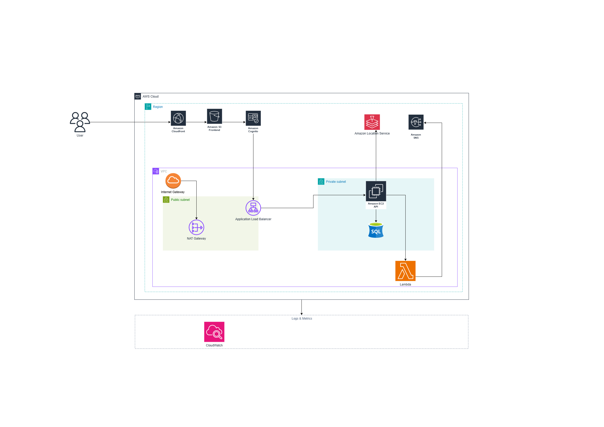

# 🩸 Blood Donation Support System (BDSS)
**Phần mềm hỗ trợ hiến máu thông minh trên AWS Cloud**

---

## 📋 Mục lục
- [Executive Summary](#-executive-summary)
- [1. Problem Statement](#1-problem-statement)
- [2. Solution Architecture](#2-solution-architecture)
- [3. Technical Implementation](#3-technical-implementation)
- [4. Timeline & Milestones](#4-timeline--milestones)
- [5. Budget Estimation](#5-budget-estimation)
- [6. Risk Assessment](#6-risk-assessment)
- [7. Expected Outcomes](#7-expected-outcomes)
- [Appendices](#appendices)

---

## 📄 Executive Summary
**BDSS** giúp **kết nối người hiến máu ↔ người cần máu**, **quản lý tồn kho**, và **điều phối ca khẩn** với matching tự động & dashboard realtime.

**Kiến trúc 3-tier trên AWS:**
- **Frontend**: React SPA (tìm kiếm theo vị trí, quản lý ca hiến)  
- **Backend**: .NET Web API (nghiệp vụ y tế, REST API, matching)  
- **Database**: SQL Server trên EC2 (PostGIS cho dữ liệu vị trí)  
- **Auth**: AWS Cognito (JWT, RBAC)  
- **Realtime**: AppSync (GraphQL Subscriptions) / SNS  
- **Notifications**: SNS/SES (SMS/Email)  
- **Storage**: S3 (hồ sơ, chứng nhận)

**Lợi ích chính**
- ⏱️ Giảm **60%** thời gian xử lý ca khẩn  
- 🧪 Nâng **40%** hiệu quả quản lý tồn kho  
- 💸 Chi phí **~30–35 USD/tháng**, hoàn vốn **~6 tháng**

---

## 1. Problem Statement
### Current Situation
- Quản lý thủ công (gọi điện, bài đăng, Excel)  
- Thiếu realtime, không có cảnh báo khẩn, không matching tự động

### Key Challenges
- ❌ Matching tự động theo nhóm máu & vị trí  
- ❌ Realtime alerts cho ca khẩn  
- ❌ Dashboard phân tích tồn kho  
- ❌ Quy trình rời rạc, nhiều thao tác tay

### Stakeholder Impact
- 🩸 **Người hiến**: Không biết khi nào cần, không được nhắc  
- 🏥 **Người cần máu**: Khó tìm người phù hợp, thiếu realtime  
- 👩‍⚕️ **Nhân viên y tế**: Tốn thời gian, dễ sai sót  
- 🧭 **Cơ sở y tế**: Thiếu dữ liệu để dự báo nguồn máu

### Business Consequences
- Chậm trễ xử lý ca khẩn, tồn kho kém hiệu quả → rủi ro bệnh nhân.

---

## 2. Solution Architecture
### Architecture Overview

### Các thành phần chính
**Edge & Frontend**
- CloudFront (CDN) • S3 (SPA) • Cognito (Auth & RBAC)

**Application & API**
- EC2 (.NET Web API) • Lambda (job, matching)  
- Location Service (định vị) • SNS/Pinpoint (thông báo)

**Data & Analytics**
- SQL Server (EC2) • S3 (Data/Logs) • QuickSight (Dashboard)

### AWS Services Used
| Service | Vai trò |
|---|---|
| EC2 | Chạy .NET API & SQL Server |
| S3 | Lưu ảnh, tài liệu, chứng nhận |
| Cognito | Xác thực & phân quyền |
| Lambda | Tác vụ tự động, nhắc nhở |
| SNS/Pinpoint | Gửi thông báo khẩn |
| Location Service | Tìm người hiến gần nhất |
| QuickSight | Dashboard & báo cáo |

### Security Architecture
- Cognito (JWT, RBAC), IAM theo nguyên tắc least-privilege  
- HTTPS + WAF (bảo vệ API)  
- Mã hoá AES-256 at-rest & in-transit  
- Theo chuẩn **HIPAA** (logging, auditing)

### Scalability
- EC2 Auto Scaling + Multi-AZ DB  
- AppSync/SNS/S3 tự động scale  
- PostGIS indexing cho truy vấn địa lý

---

## 3. Technical Implementation
### Implementation Phases
| Giai đoạn | Nội dung chính | Deliverables |
|---:|---|---|
| Phase 1 | Requirements & Design | PRD, ERD, Blood Matrix |
| Phase 2 | Backend API | .NET API, SQL schema |
| Phase 3 | Frontend UI | React SPA, Donor Portal |
| Phase 4 | Auth & Matching | Cognito RBAC, matching logic |
| Phase 5 | Notifications/Realtime | SNS/SES, AppSync |
| Phase 6 | Testing & Deployment | CI/CD, Compliance tests |

### Technical Requirements
- EC2 t3.small (API + DB) •  S3 ~10GB  
- Lambda 256MB (schedulers, reminders)  
- SES/SNS ≥5.000 messages/tháng

### Development Approach
- Agile 2-week sprints • REST + GraphQL Subscriptions  
- IaC: Terraform • Compliance: HIPAA

### Testing Strategy
- Unit (xUnit) • Integration (Postman)  
- Load (JMeter) • UI (Cypress)

### Deployment Plan
- GitHub Actions CI/CD • Blue-green EC2  
- Backup & DR • Audit logging

---

## 4. Timeline & Milestones
| Giai đoạn | Thời gian | Kết quả |
|---:|---|---|
| Week 1–2 | Requirement & Architecture | PRD, ERD, Matrix |
| Week 3–5 | Backend | CRUD + Matching |
| Week 6–8 | Frontend | Donor Portal, Alerts |
| Week 9–10 | Realtime/Notify | AppSync + SNS/SES |
| Week 11 | Testing | Load + Compliance |
| Week 12 | Deployment | EC2 + Demo |

---

## 5. Budget Estimation
| Thành phần | Chi phí/tháng |
|---|---|
| EC2 (t3.small) | ~$15 |
| S3 (10GB) | ~$3 |
| Cognito | ~$0 (50k MAU free) |
| SNS/SES (5k) | ~$8 |
| Lambda | ~$4 |
| **Tổng** | **~$30–35** |

> ROI: giảm ~70% chi phí thủ công (~$100/tháng) → hoà vốn ~6 tháng.

---

## 6. Risk Assessment
| Rủi ro | Ảnh hưởng | Xác suất | Giảm thiểu |
|---|---|---|---|
| Chi phí vượt dự kiến | Medium | Medium | Free-tier + monitoring |
| Tải cao ca khẩn | High | Low | AppSync auto-scale |
| Bảo mật dữ liệu | High | Medium | Cognito + WAF + IAM |
| Sai matching | Critical | Low | Medical validation |
| Notification fail | High | Medium | Multi-channel + retry |
| Donor no-show | Medium | High | Backup matching |

---

## 7. Expected Outcomes
- ⚙️ **Technical**: 5.000+ users, 100+ ca khẩn/tháng  
- 🩸 **Healthcare**: −60% thời gian phản hồi ca khẩn  
- 📊 **Business**: ROI 6 tháng, chi phí thấp  
- 🏥 **Strategic**: Mở rộng liên kết nhiều cơ sở y tế

---

## Appendices
- A. Technical Specs — ERD, API endpoints, compatibility matrix  
- B. Cost Calculations — AWS Calculator  
- C. Architecture Diagrams — Logical & Physical  
- D. Medical Compliance — HIPAA & blood safety  
- E. References — AWS docs, case studies
